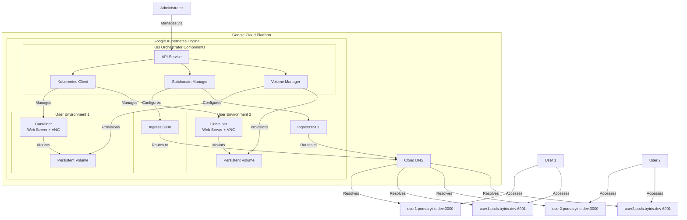
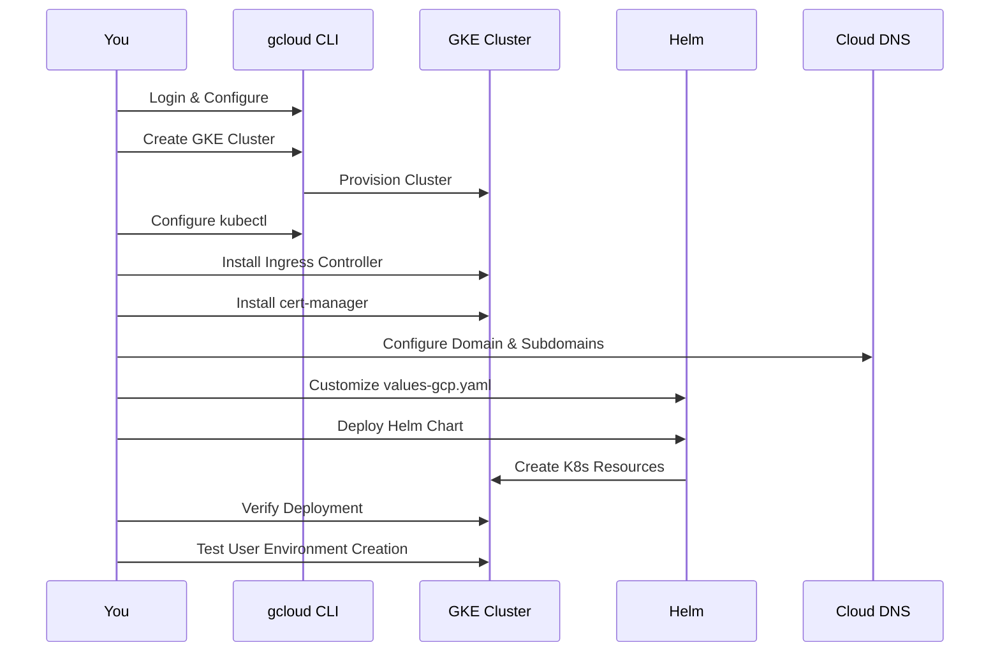
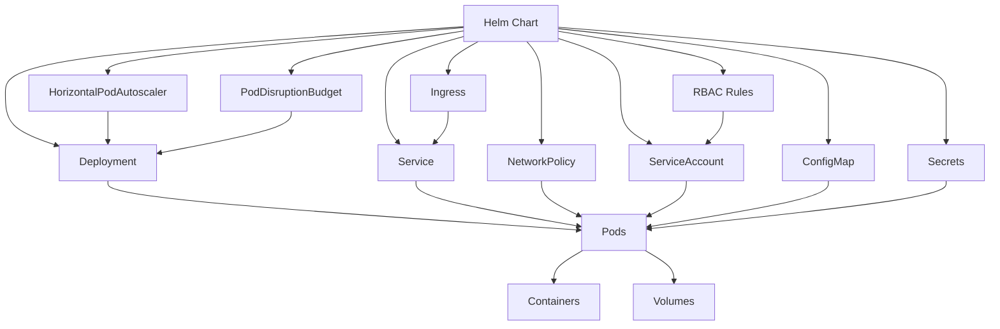
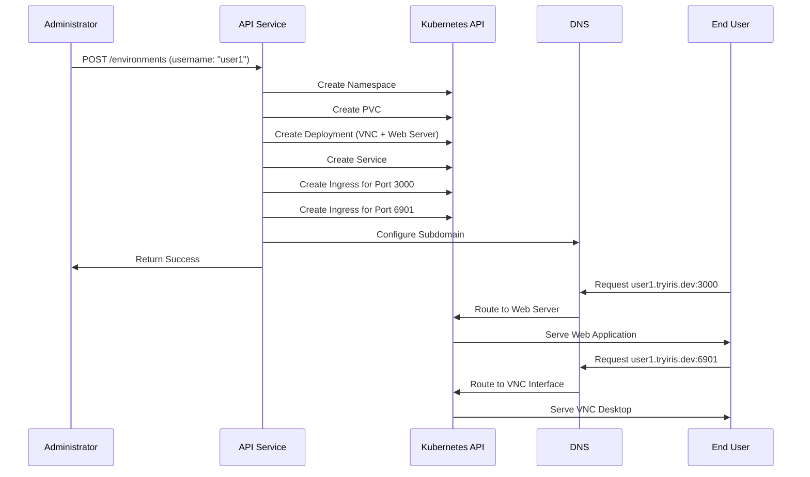

# Deploying K8s Orchestrator to Google Kubernetes Engine (GKE)

## Architecture Overview

The following diagram shows the high-level architecture of the K8s Orchestrator deployment on GKE:



## Prerequisites

Before you begin, ensure you have the following:

- Google Cloud Platform account with billing enabled
- `gcloud` CLI installed and configured
- `kubectl` installed
- `helm` (v3.2.0+) installed
- Domain name: tryiris.dev with pods.tryiris.dev for user environments

## Deployment Process Flow



## 1. Setting Up Google Cloud and GKE Cluster

### Install Google Cloud SDK (if not already installed)

```bash
# Download and install the Google Cloud SDK
curl https://sdk.cloud.google.com | bash
exec -l $SHELL
```

### Login and Set Project

```bash
# Login to your Google Cloud account
gcloud auth login

# Set your project ID
gcloud config set project YOUR_PROJECT_ID
```

### Enable Required APIs

```bash
# Enable the Kubernetes Engine API
gcloud services enable container.googleapis.com
```

### Create a GKE Cluster

```bash
# Create a GKE cluster with 3 nodes
gcloud container clusters create k8s-orchestrator \
  --region us-central1 \
  --num-nodes=3 \
  --machine-type=e2-standard-4 \
  --release-channel=regular
```

### Configure kubectl to Use the GKE Cluster

```bash
# Get credentials for your GKE cluster
gcloud container clusters get-credentials k8s-orchestrator --region us-central1
```

## 2. Setting Up Core Kubernetes Components

### Install NGINX Ingress Controller

```bash
# Create the cluster role binding (required for NGINX Ingress)
kubectl create clusterrolebinding cluster-admin-binding \
  --clusterrole cluster-admin \
  --user $(gcloud config get-value account)

# Install NGINX Ingress Controller
kubectl apply -f https://raw.githubusercontent.com/kubernetes/ingress-nginx/controller-v1.8.2/deploy/static/provider/cloud/deploy.yaml

# Wait for the Ingress Controller to be ready
kubectl wait --namespace ingress-nginx \
  --for=condition=ready pod \
  --selector=app.kubernetes.io/component=controller \
  --timeout=120s
```

### Install cert-manager for TLS Certificates

```bash
# Install cert-manager
kubectl apply -f https://github.com/cert-manager/cert-manager/releases/download/v1.12.0/cert-manager.yaml

# Wait for cert-manager to be ready
kubectl wait --namespace cert-manager \
  --for=condition=ready pod \
  --selector=app.kubernetes.io/component=controller \
  --timeout=120s
```

### Create ClusterIssuer for Let's Encrypt

Create a file named `letsencrypt-prod.yaml`:

```yaml
apiVersion: cert-manager.io/v1
kind: ClusterIssuer
metadata:
  name: letsencrypt-prod
spec:
  acme:
    server: https://acme-v02.api.letsencrypt.org/directory
    email: admin@tryiris.dev
    privateKeySecretRef:
      name: letsencrypt-prod
    solvers:
    - http01:
        ingress:
          class: nginx
```

Apply the configuration:

```bash
# The email is already set to admin@tryiris.dev

# Apply the ClusterIssuer
kubectl apply -f letsencrypt-prod.yaml
```

## 3. Configuring DNS with Namecheap for tryiris.dev

After deploying your GKE cluster and ingress controller, you'll need to configure the DNS records in Namecheap:

1. Get the Ingress Controller's external IP address:

```bash
# Get the Ingress IP
INGRESS_IP=$(kubectl get service -n ingress-nginx ingress-nginx-controller -o jsonpath='{.status.loadBalancer.ingress[0].ip}')
echo $INGRESS_IP  # Make note of this IP for Namecheap configuration
```

2. In Namecheap's dashboard:
   - Go to Dashboard → Domain List → Manage → Advanced DNS
   - Add the following A records:

   | Type | Host | Value | TTL |
   |------|------|-------|-----|
   | A Record | api.pods | {INGRESS_IP} | Automatic |
   | A Record | *.pods | {INGRESS_IP} | Automatic |

3. Wait for DNS propagation (can take up to 24-48 hours, but often much faster)

## 4. Deploying with Helm

### Resource Relationships in Helm Chart



### Customize the values-gcp.yaml File

Navigate to the Helm chart directory:

```bash
cd helm/k8s-orchestrator
```

Edit the `values-gcp.yaml` file to match your deployment:

```yaml
# Deployment configuration
replicaCount: 2

image:
  repository: shanurcsenitap/irisk8s
  tag: latest
  pullPolicy: Always

# Resource limits
resources:
  limits:
    cpu: 1000m
    memory: 1Gi
  requests:
    cpu: 500m
    memory: 512Mi

# Autoscaling configuration
autoscaling:
  enabled: true
  minReplicas: 2
  maxReplicas: 5
  targetCPUUtilizationPercentage: 80

# Cloud provider specific settings
cloudProvider:
  gcp:
    enabled: true
    ingressClass: "nginx"
    annotations:
      nginx.ingress.kubernetes.io/proxy-connect-timeout: "3600"
      nginx.ingress.kubernetes.io/proxy-read-timeout: "3600"
      nginx.ingress.kubernetes.io/proxy-send-timeout: "3600"
      cert-manager.io/cluster-issuer: "letsencrypt-prod"
    storageClass: "standard-rwo"

# Environment variables
env:
  DOMAIN: "pods.tryiris.dev"  # Domain for user environments

# Ingress configuration
ingress:
  enabled: true
  className: "nginx"
  annotations:
    nginx.ingress.kubernetes.io/ssl-redirect: "true"
  hosts:
    - host: api.pods.tryiris.dev
      paths:
        - path: /
          pathType: Prefix
  tls:
    - secretName: k8s-orchestrator-tls
      hosts:
        - api.pods.tryiris.dev

# User environment configuration
userEnvironments:
  defaultImage: "accetto/ubuntu-vnc-xfce-firefox-g3"
  defaultPorts: [5901, 6901]
  defaultVolumeSize: "5Gi"

# Network policies
networkPolicies:
  enabled: true

# RBAC configuration
rbac:
  create: true
  rules:
    - apiGroups: [""]
      resources: ["namespaces", "pods", "services", "persistentvolumeclaims"]
      verbs: ["get", "list", "watch", "create", "update", "patch", "delete"]
    - apiGroups: ["apps"]
      resources: ["deployments"]
      verbs: ["get", "list", "watch", "create", "update", "patch", "delete"]
    - apiGroups: ["networking.k8s.io"]
      resources: ["ingresses", "networkpolicies"]
      verbs: ["get", "list", "watch", "create", "update", "patch", "delete"]
```

### Install the Helm Chart

```bash
# Make sure you're in the helm chart directory
cd helm/k8s-orchestrator

# Install the chart
helm install k8s-orchestrator . -f values-gcp.yaml
```

## 5. Verifying the Deployment

### Check Deployment Status

```bash
# Check the pods
kubectl get pods -l app.kubernetes.io/instance=k8s-orchestrator

# Check the service
kubectl get service -l app.kubernetes.io/instance=k8s-orchestrator

# Check the ingress
kubectl get ingress -l app.kubernetes.io/instance=k8s-orchestrator
```

### Test the API

```bash
# Wait for the Ingress to get an IP and for DNS to propagate
kubectl get ingress -l app.kubernetes.io/instance=k8s-orchestrator

# Test the API health endpoint
curl -k https://api.yourdomain.com/health
```

### User Environment Provisioning Flow



## 6. Creating and Accessing User Environments

### Create a User Environment

```bash
# Create a user environment via the API
curl -X POST https://api.pods.tryiris.dev/environments \
  -H "Content-Type: application/json" \
  -d '{
    "username": "testuser",
    "image": "accetto/ubuntu-vnc-xfce-firefox-g3",
    "ports": [3000, 6901]
  }'
```

### Access the User Environment

The user environment provides two main interfaces, both accessible via HTTPS:

1. **Web Server (Port 3000)**: Access the user's web server
   - URL: `https://testuser.pods.tryiris.dev:3000`
   - This is where the user's web application is served

2. **VNC Web Interface (Port 6901)**: Access the VNC desktop environment
   - URL: `https://testuser.pods.tryiris.dev:6901`
   - Provides a web-based VNC interface to the virtual desktop
   - Credentials are typically `headless:headless` (default for the VNC image)

### Verify the Created Resources

```bash
# Check the namespace
kubectl get namespace user-testuser

# Check resources in the user's namespace
kubectl get all -n user-testuser

# Check the persistent volume claim
kubectl get pvc -n user-testuser

# Check the ingress
kubectl get ingress -n user-testuser
```

## 7. Scaling and Managing the Deployment

### Scaling the Orchestrator Service

```bash
# Scale the deployment manually
kubectl scale deployment k8s-orchestrator --replicas=3

# Or update the Helm values and upgrade
helm upgrade k8s-orchestrator . -f values-gcp.yaml
```

### Upgrading the Deployment

```bash
# Pull the latest image
docker pull shanurcsenitap/irisk8s:latest

# Update your values file if needed
# Then upgrade the Helm release
helm upgrade k8s-orchestrator . -f values-gcp.yaml
```

## 8. Troubleshooting

### Common Issues and Solutions

#### Ingress Issues

If your Ingress is not working properly:

```bash
# Check Ingress status
kubectl get ingress -l app.kubernetes.io/instance=k8s-orchestrator

# Check Ingress events
kubectl describe ingress -l app.kubernetes.io/instance=k8s-orchestrator

# Check NGINX Ingress Controller logs
kubectl logs -n ingress-nginx -l app.kubernetes.io/component=controller
```

#### Certificate Issues

If TLS certificates are not being issued:

```bash
# Check cert-manager logs
kubectl logs -n cert-manager -l app.kubernetes.io/component=controller

# Check certificate status
kubectl get certificates -A

# Check certificate requests
kubectl get certificaterequests -A
```

#### Pod Startup Issues

If pods are not starting properly:

```bash
# Check pod status
kubectl get pods -l app.kubernetes.io/instance=k8s-orchestrator

# Check pod events
kubectl describe pod -l app.kubernetes.io/instance=k8s-orchestrator

# Check container logs
kubectl logs -l app.kubernetes.io/instance=k8s-orchestrator
```

#### User Environment Issues

If user environments are not being created:

```bash
# Check the orchestrator logs
kubectl logs -l app.kubernetes.io/instance=k8s-orchestrator

# Verify RBAC permissions
kubectl auth can-i create namespaces --as=system:serviceaccount:default:k8s-orchestrator
kubectl auth can-i create deployments --as=system:serviceaccount:default:k8s-orchestrator
kubectl auth can-i create ingress --as=system:serviceaccount:default:k8s-orchestrator
```

## 9. Cleaning Up

### Delete a User Environment

```bash
# Delete a user environment via the API
curl -X DELETE https://api.yourdomain.com/environments/testuser
```

### Uninstall the Helm Release

```bash
# Uninstall the Helm release
helm uninstall k8s-orchestrator
```

### Delete User Namespaces

```bash
# List all user namespaces
kubectl get namespaces -l app=k8s-orchestrator

# Delete all user namespaces
kubectl get namespaces -l app=k8s-orchestrator | grep user- | awk '{print $1}' | xargs kubectl delete namespace
```

### Delete the GKE Cluster

```bash
# Delete the GKE cluster
gcloud container clusters delete k8s-orchestrator --region us-central1
```

