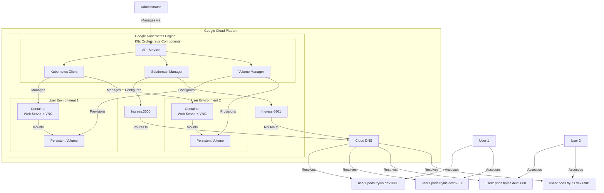
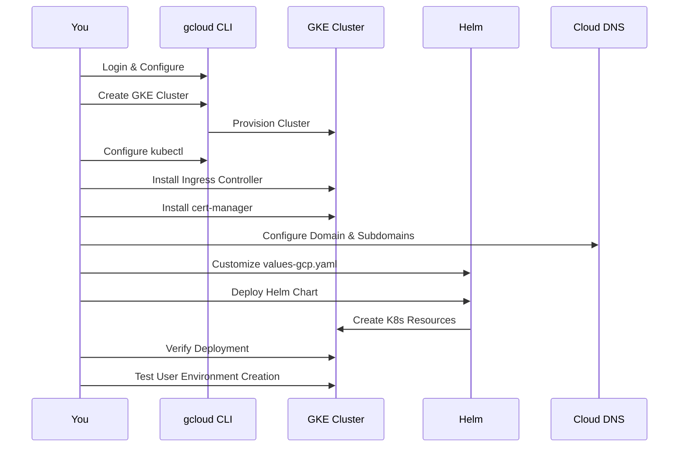
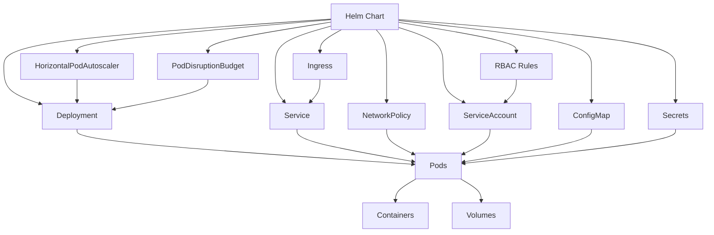
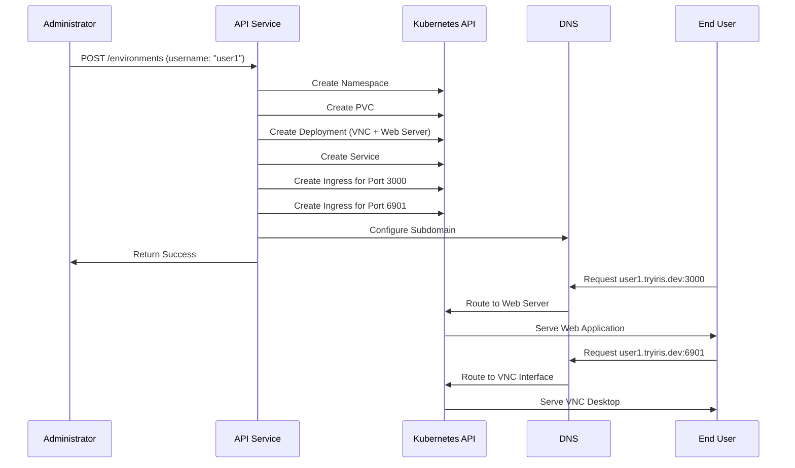

# Deploying K8s Orchestrator to Google Kubernetes Engine (GKE)

## Architecture Overview

The following diagram shows the high-level architecture of the K8s Orchestrator deployment on GKE:



## Prerequisites

Before you begin, ensure you have the following:

- Google Cloud Platform account with billing enabled
- `gcloud` CLI installed and configured
- `kubectl` installed
- `helm` (v3.2.0+) installed
- Domain name: tryiris.dev with pods.tryiris.dev for user environments

### Installing Required Tools

#### Install gcloud CLI

If you haven't installed the Google Cloud SDK:

```bash
# Download and install the Google Cloud SDK
curl https://sdk.cloud.google.com | bash
exec -l $SHELL
gcloud init  # Follow the initialization steps
```

#### Install kubectl and GKE Auth Plugin

For GKE, you need both kubectl and the GKE auth plugin. Here are your installation options:

##### Option 1: Install using our script (Recommended)

We provide a script that automatically detects your server version and installs the compatible kubectl. The script is included in the repository at `scripts/install_kubectl.sh`.

```bash
# Run the script directly from the repository
bash scripts/install_kubectl.sh

# After installation is complete, the script will verify the kubectl version
# The kubectl binary will be installed to the appropriate location on your system
```

This script will:
- Detect your OS and architecture
- Check your current server version (if possible)
- Download and install the matching kubectl version
- Add it to your PATH if necessary

##### Option 2: Install via gcloud CLI

You can install kubectl through the gcloud CLI:

```bash
# Install kubectl via Google Cloud SDK
gcloud components install kubectl

# Verify the installation
kubectl version --client
```

##### Option 3: Manual installation

**For macOS:**
```bash
# Using Homebrew
brew install kubectl

# Or using curl (replace X.Y.Z with your server version)
curl -LO "https://dl.k8s.io/release/vX.Y.Z/bin/darwin/amd64/kubectl"
chmod +x ./kubectl
sudo mv ./kubectl /usr/local/bin/kubectl
```

**For Linux:**
```bash
# Download the binary (replace X.Y.Z with your server version)
curl -LO "https://dl.k8s.io/release/vX.Y.Z/bin/linux/amd64/kubectl"
chmod +x kubectl
sudo mv kubectl /usr/local/bin/kubectl
```

> **Important**: For optimal compatibility, make sure your kubectl version is within one minor version of your cluster's version (e.g., v1.31.x client works with v1.32.x server).

#### Install GKE Auth Plugin (Required)

The GKE auth plugin is required for kubectl to authenticate with GKE clusters. If you see this error:

```
CRITICAL: ACTION REQUIRED: gke-gcloud-auth-plugin, which is needed for continued use of kubectl, was not found or is not executable.
```

Install the plugin using one of these methods:

**Option 1: Install via gcloud CLI (Recommended)**

```bash
# Install the GKE auth plugin
gcloud components install gke-gcloud-auth-plugin

# Verify the installation
gke-gcloud-auth-plugin --version
```

**Option 2: Install via package manager**

**For macOS:**
```bash
# Using Homebrew
brew install --cask google-cloud-sdk
```

**For Ubuntu/Debian:**
```bash
# Add the Google Cloud SDK distribution URI as a package source
echo "deb [signed-by=/usr/share/keyrings/cloud.google.gpg] https://packages.cloud.google.com/apt cloud-sdk main" | sudo tee -a /etc/apt/sources.list.d/google-cloud-sdk.list

# Import the Google Cloud public key
curl https://packages.cloud.google.com/apt/doc/apt-key.gpg | sudo apt-key --keyring /usr/share/keyrings/cloud.google.gpg add -

# Update and install the Cloud SDK and GKE auth plugin
sudo apt-get update && sudo apt-get install google-cloud-cli google-cloud-sdk-gke-gcloud-auth-plugin
```

**For RHEL/CentOS/Fedora:**
```bash
# Update YUM with Cloud SDK repo information
sudo tee -a /etc/yum.repos.d/google-cloud-sdk.repo << EOM
[google-cloud-cli]
name=Google Cloud CLI
baseurl=https://packages.cloud.google.com/yum/repos/cloud-sdk-el8-x86_64
enabled=1
gpgcheck=1
repo_gpgcheck=0
gpgkey=https://packages.cloud.google.com/yum/doc/rpm-package-key.gpg
EOM

# Install the Cloud SDK and GKE auth plugin
sudo yum install google-cloud-cli google-cloud-sdk-gke-gcloud-auth-plugin
```

After installation, verify that kubectl can use the plugin by running a simple kubectl command against your GKE cluster.

#### Install Helm

```bash
# For macOS (using Homebrew)
brew install helm

# For Linux
curl https://raw.githubusercontent.com/helm/helm/main/scripts/get-helm-3 | bash
```

## Deployment Process Flow



## 1. Setting Up Google Cloud and GKE Cluster

### Install Google Cloud SDK (if not already installed)

```bash
# Download and install the Google Cloud SDK
curl https://sdk.cloud.google.com | bash
exec -l $SHELL
```

### Login and Set Project

```bash
# Login to your Google Cloud account
gcloud auth login

# List available projects
gcloud projects list

# Set your project ID (use the PROJECT_ID from the list, not the PROJECT_NUMBER)
gcloud config set project YOUR_PROJECT_ID

# Set the quota project for Application Default Credentials (important for billing)
gcloud auth application-default set-quota-project YOUR_PROJECT_ID

# Verify your configuration
gcloud config list
```

### Enable Required APIs

```bash
# Enable the Kubernetes Engine API
gcloud services enable container.googleapis.com
```

### Create a GKE Autopilot Cluster

Create a GKE Autopilot cluster in Singapore region:

```bash
# Create a GKE Autopilot cluster in Singapore region
gcloud container clusters create-auto k8s-orchestrator \
  --region asia-southeast1 \
  --release-channel=regular
```

Autopilot automatically manages the infrastructure, including:
- Node provisioning and scaling
- Security and node upgrades
- Resource optimization

### Set Resource Quotas

After cluster creation, set resource quotas to limit usage and costs:

```bash
# Create a cluster-wide resource quota to prevent unexpected billing
kubectl create -f - <<EOF
apiVersion: v1
kind: ResourceQuota
metadata:
  name: cluster-resource-quota
  namespace: default
spec:
  hard:
    requests.cpu: "8"      # Maximum 8 cores across the entire cluster
    requests.memory: 32Gi  # Maximum 32GB memory across the entire cluster
    limits.cpu: "16"       # Maximum burst capacity of 16 cores
    limits.memory: 64Gi    # Maximum burst capacity of 64GB memory
    pods: "50"             # Maximum 50 pods total
EOF
```

### Configure kubectl to Use the GKE Autopilot Cluster

After creating your cluster for the first time, you need to get the Kubernetes credentials:

```bash
# Get credentials for your GKE Autopilot cluster
# This configures kubectl to use your new cluster
gcloud container clusters get-credentials k8s-orchestrator --region asia-southeast1
```

This command:
1. Downloads the cluster's credentials
2. Creates or updates your kubeconfig file (~/.kube/config)
3. Sets your current context to the new cluster

Verify that kubectl is properly configured:

```bash
# Check if kubectl is properly configured
kubectl cluster-info

# List all nodes in your cluster
kubectl get nodes
```

If these commands succeed, you're ready to proceed. If you encounter any errors, make sure:
- You're logged in with gcloud (`gcloud auth login`)
- The cluster creation has completed
- You're using the correct project ID

> **Note**: For common administrative operations and commands to manage your cluster after deployment, please see the [Kubernetes Cluster Administration Guide](../admin/kubernetes-operations.md)


## 2. Setting Up Core Kubernetes Components

### Install NGINX Ingress Controller

```bash
# Create the cluster role binding (required for NGINX Ingress)
kubectl create clusterrolebinding cluster-admin-binding \
  --clusterrole cluster-admin \
  --user $(gcloud config get-value account)

# Install NGINX Ingress Controller
kubectl apply -f https://raw.githubusercontent.com/kubernetes/ingress-nginx/controller-v1.8.2/deploy/static/provider/cloud/deploy.yaml

# Wait for the Ingress Controller to be ready
kubectl wait --namespace ingress-nginx \
  --for=condition=ready pod \
  --selector=app.kubernetes.io/component=controller \
  --timeout=120s
```

### Install cert-manager for TLS Certificates

```bash
# Install cert-manager
kubectl apply -f https://github.com/cert-manager/cert-manager/releases/download/v1.12.0/cert-manager.yaml

# Wait for cert-manager to be ready
kubectl wait --namespace cert-manager \
  --for=condition=ready pod \
  --selector=app.kubernetes.io/component=controller \
  --timeout=120s
```

### Create ClusterIssuer for Let's Encrypt

Create a file named `letsencrypt-prod.yaml`:

```yaml
apiVersion: cert-manager.io/v1
kind: ClusterIssuer
metadata:
  name: letsencrypt-prod
spec:
  acme:
    server: https://acme-v02.api.letsencrypt.org/directory
    email: admin@tryiris.dev
    privateKeySecretRef:
      name: letsencrypt-prod
    solvers:
    - http01:
        ingress:
          class: nginx
```

Apply the configuration:

```bash
# The email is already set to admin@tryiris.dev

# Apply the ClusterIssuer
kubectl apply -f letsencrypt-prod.yaml
```

## 3. Configuring DNS with Namecheap for tryiris.dev

After deploying your GKE cluster and ingress controller, you'll need to configure the DNS records in Namecheap:

1. Get the Ingress Controller's external IP address:

```bash
# Get the Ingress IP
INGRESS_IP=$(kubectl get service -n ingress-nginx ingress-nginx-controller -o jsonpath='{.status.loadBalancer.ingress[0].ip}')
echo $INGRESS_IP  # Make note of this IP for Namecheap configuration
```

2. In Namecheap's dashboard:
   - Go to Dashboard → Domain List → Manage → Advanced DNS
   - Add the following A records:

   | Type | Host | Value | TTL |
   |------|------|-------|-----|
   | A Record | api.pods | {INGRESS_IP} | Automatic |
   | A Record | *.pods | {INGRESS_IP} | Automatic |

3. Wait for DNS propagation (can take up to 24-48 hours, but often much faster)

## 4. Deploying with Helm

### Resource Relationships in Helm Chart



### Use the Prepared Autopilot Values File

We've created a ready-to-use values file for GKE Autopilot deployments. Navigate to the Helm chart directory and use the pre-configured file:

```bash
cd helm/k8s-orchestrator

# The values-gcp-autopilot.yaml file is already configured for Autopilot deployments
# If you want to examine it:
cat values-gcp-autopilot.yaml

# If you need to make any customizations, use:
# vim values-gcp-autopilot.yaml
# or
# nano values-gcp-autopilot.yaml
```

The pre-configured `values-gcp-autopilot.yaml` includes:

1. **Enhanced resource allocations** for better performance:
   - 1 CPU core (1000m) limit and 0.5 CPU core (500m) request for the orchestrator
   - 1GB memory limit and 512MB memory request
   - Doubled VNC container resources for smoother user experience
   - 4GB persistent volume size for user environments

2. **Optimized resource quotas**:
   - 16 CPU cores total cluster capacity
   - 64GB memory total cluster capacity
   - 4 CPU cores per user environment
   - 8GB memory per user environment

3. **Optimized autoscaling settings**
4. **Properly configured RBAC permissions**
5. **Network policies for security**

The values file is optimized for performance while maintaining cost control.

### Install the Helm Chart

```bash
# Make sure you're in the helm chart directory
cd helm/k8s-orchestrator

# Install the chart using the Autopilot values file
helm install k8s-orchestrator . -f values-gcp-autopilot.yaml
```

## 5. Verifying the Deployment

### Check Deployment Status

```bash
# Check the pods
kubectl get pods -l app.kubernetes.io/instance=k8s-orchestrator

# Check the service
kubectl get service -l app.kubernetes.io/instance=k8s-orchestrator

# Check the ingress
kubectl get ingress -l app.kubernetes.io/instance=k8s-orchestrator
```

### Test the API

```bash
# Wait for the Ingress to get an IP and for DNS to propagate
kubectl get ingress -l app.kubernetes.io/instance=k8s-orchestrator

# Test the API health endpoint
curl -k https://api.yourdomain.com/health
```

### User Environment Provisioning Flow



## 6. Creating and Accessing User Environments

### Create a User Environment

```bash
# Create a user environment via the API
# Note: In Autopilot, resource requests are required for all pods
curl -X POST https://api.pods.tryiris.dev/environments \
  -H "Content-Type: application/json" \
  -d '{
    "username": "testuser",
    "image": "accetto/ubuntu-vnc-xfce-firefox-g3",
    "ports": [3000, 6901],
    "resources": {
      "requests": {
        "cpu": "250m",
        "memory": "256Mi"
      },
      "limits": {
        "cpu": "500m",
        "memory": "512Mi"
      }
    }
  }'
```

#### Resource Allocation in Autopilot

Autopilot charges based on the resources requested by pods. Here's a breakdown of resource classes and approximate costs:

| Resource Class | vCPU       | Memory     | Approximate Cost* |
|---------------|------------|------------|-------------------|
| Small         | 0.25 - 1   | 0.5 - 4 GB | $40-60/mo         |
| Medium        | 1 - 4      | 4 - 16 GB  | $150-250/mo       |
| Large         | 4 - 8      | 16 - 32 GB | $500-900/mo       |

*Costs are approximate and vary by region

##### Our Enhanced VNC Environment Resources

For VNC environments, we've configured resources for better performance:

```yaml
resources:
  requests:
    cpu: 500m        # 0.5 vCPU
    memory: 512Mi    # 512 MB RAM
  limits:
    cpu: 1000m       # 1 vCPU
    memory: 1024Mi   # 1 GB RAM
```

This configuration provides a good balance of performance and cost. With our resource quotas, each user environment can scale up to 4 CPU cores and 8GB memory if needed.

### Access the User Environment

The user environment provides two main interfaces, both accessible via HTTPS:

1. **Web Server (Port 3000)**: Access the user's web server
   - URL: `https://testuser.pods.tryiris.dev:3000`
   - This is where the user's web application is served

2. **VNC Web Interface (Port 6901)**: Access the VNC desktop environment
   - URL: `https://testuser.pods.tryiris.dev:6901`
   - Provides a web-based VNC interface to the virtual desktop
   - Credentials are typically `headless:headless` (default for the VNC image)

### Verify the Created Resources

```bash
# Check the namespace
kubectl get namespace user-testuser

# Check resources in the user's namespace
kubectl get all -n user-testuser

# Check the persistent volume claim
kubectl get pvc -n user-testuser

# Check the ingress
kubectl get ingress -n user-testuser
```

## 7. Scaling and Managing the Deployment

### Cost Control in Autopilot

In Autopilot mode, you can't directly control node count, but you can control costs through the following methods:

#### 1. ResourceQuotas

We always use ResourceQuotas to limit total CPU and memory usage:

```bash
# We already created a default ResourceQuota during cluster setup
# For each user namespace, we add an additional ResourceQuota to limit their resources:
kubectl create -f - <<EOF
apiVersion: v1
kind: ResourceQuota
metadata:
  name: user-compute-resources
  namespace: user-environment-namespace
spec:
  hard:
    requests.cpu: "2"      # Maximum 2 cores per user
    requests.memory: 4Gi   # Maximum 4GB memory per user
    limits.cpu: "4"        # Maximum 4 cores burst per user
    limits.memory: 8Gi     # Maximum 8GB memory burst per user
    pods: "5"              # Maximum 5 pods per user
EOF
```

Check existing quotas:

```bash
kubectl get resourcequota --all-namespaces
```

#### 2. LimitRanges

We apply LimitRanges to every namespace to enforce resource constraints:

```bash
# Apply a LimitRange to each user namespace to ensure all containers have appropriate limits
kubectl create -f - <<EOF
apiVersion: v1
kind: LimitRange
metadata:
  name: default-limits
  namespace: user-environment-namespace
spec:
  limits:
  - default:
      cpu: 500m         # Default limit of 0.5 cores
      memory: 512Mi     # Default limit of 512MB RAM
    defaultRequest:
      cpu: 250m         # Default request of 0.25 cores
      memory: 256Mi     # Default request of 256MB RAM
    max:
      cpu: "2"          # Maximum of 2 cores per container
      memory: 4Gi       # Maximum of 4GB RAM per container
    min:
      cpu: 100m         # Minimum of 0.1 cores per container
      memory: 64Mi      # Minimum of 64MB RAM per container
    type: Container
EOF
```

Verify the LimitRange:

```bash
kubectl get limitrange -n user-environment-namespace
```

#### 3. Pod Resource Specifications

Always set appropriate requests/limits in pod specs for all deployments.

#### 4. Budget Notifications

We always set up Google Cloud budget alerts:

```bash
# Get your billing account ID
gcloud billing accounts list
```

```bash
# Set up a budget alert via gcloud (REQUIRED for all clusters)
gcloud billing budgets create \
  --billing-account=YOUR_BILLING_ACCOUNT_ID \
  --display-name="GKE Budget - k8s-orchestrator" \
  --budget-amount=500 \
  --threshold-rules=threshold-percent=0.5,basis=current_spend \
  --threshold-rules=threshold-percent=0.8,basis=current_spend \
  --threshold-rules=threshold-percent=1.0,basis=current_spend \
  --email=your-team-email@tryiris.dev
```

### Scaling the Orchestrator Service

```bash
# Scale the deployment manually (pod count only in Autopilot)
kubectl scale deployment k8s-orchestrator --replicas=3

# Or update the Helm values and upgrade
helm upgrade k8s-orchestrator . -f values-gcp-autopilot.yaml
```

### Upgrading the Deployment

```bash
# Pull the latest image
docker pull shanurcsenitap/irisk8s:latest

# Update your values file if needed
# Then upgrade the Helm release
helm upgrade k8s-orchestrator . -f values-gcp-autopilot.yaml
```

## 8. Troubleshooting

### Common Issues and Solutions

#### Autopilot-Specific Issues

If you encounter issues with GKE Autopilot:

```bash
# Error: Pod scheduling failure due to resource requirements
# Solution: Ensure all pods have resource requests set
kubectl describe pod [pod-name]  # Check for resource-related events

# Error: Unsupported features in Autopilot
# Solution: Check Autopilot limitations
# Common limitations:
# - DaemonSets require special permissions
# - Local persistent volumes are not supported
# - Some privileged operations are restricted
# - Custom node configurations are not available
gcloud container clusters describe k8s-orchestrator --region asia-southeast1 | grep autopilot

# Switch to Standard mode if Autopilot limitations are too restrictive
gcloud container clusters update k8s-orchestrator --region asia-southeast1 --no-enable-autopilot
```

#### Kubelet Readonly Port Warning

If you see warnings about the deprecated Kubelet readonly port:

```
Note: The Kubelet readonly port (10255) is now deprecated. Please update your workloads to use the recommended alternatives.
```

This is a standard warning from GKE. In most cases, you don't need to do anything as your workloads likely don't use this port directly.

#### GKE Auth Plugin and Kubectl Issues

If you encounter errors related to kubectl authentication or version compatibility:

```bash
# Error: "CRITICAL: ACTION REQUIRED: gke-gcloud-auth-plugin, which is needed for continued use of kubectl, was not found or is not executable."
# Solution: Install the GKE auth plugin
gcloud components install gke-gcloud-auth-plugin

# Error: "WARNING: version difference between client (X.Y) and server (A.B) exceeds the supported minor version skew of +/-1"
# Solution: Install the compatible kubectl version using our script

# Run the script directly from the repository - this will install both kubectl and the GKE auth plugin
bash scripts/install_kubectl.sh

# This will install the correct kubectl version compatible with your server and the required auth plugin
```

#### Project ID and Quota Issues

If you encounter errors related to project ID or quota:

```bash
# Error: The value of ``core/project'' property is set to project number
# Solution: Set the project ID (not number)
gcloud projects list  # Get the PROJECT_ID
gcloud config set project YOUR_PROJECT_ID  # Use the ID, not the number

# Error: Quota issues or unexpected billing
# Solution: Set the quota project
gcloud auth application-default set-quota-project YOUR_PROJECT_ID

# Error: Authentication issues
# Solution: Re-login and select the correct account
gcloud auth login
gcloud config set account YOUR_EMAIL@DOMAIN.COM
```

#### Ingress Issues

If your Ingress is not working properly:

```bash
# Check Ingress status
kubectl get ingress -l app.kubernetes.io/instance=k8s-orchestrator

# Check Ingress events
kubectl describe ingress -l app.kubernetes.io/instance=k8s-orchestrator

# Check NGINX Ingress Controller logs
kubectl logs -n ingress-nginx -l app.kubernetes.io/component=controller
```

#### Certificate Issues

If TLS certificates are not being issued:

```bash
# Check cert-manager logs
kubectl logs -n cert-manager -l app.kubernetes.io/component=controller

# Check certificate status
kubectl get certificates -A

# Check certificate requests
kubectl get certificaterequests -A
```

#### Pod Startup Issues

If pods are not starting properly:

```bash
# Check pod status
kubectl get pods -l app.kubernetes.io/instance=k8s-orchestrator

# Check pod events
kubectl describe pod -l app.kubernetes.io/instance=k8s-orchestrator

# Check container logs
kubectl logs -l app.kubernetes.io/instance=k8s-orchestrator
```

#### User Environment Issues

If user environments are not being created:

```bash
# Check the orchestrator logs
kubectl logs -l app.kubernetes.io/instance=k8s-orchestrator

# Verify RBAC permissions
kubectl auth can-i create namespaces --as=system:serviceaccount:default:k8s-orchestrator
kubectl auth can-i create deployments --as=system:serviceaccount:default:k8s-orchestrator
kubectl auth can-i create ingress --as=system:serviceaccount:default:k8s-orchestrator
```

## 9. Cleaning Up

### Delete a User Environment

```bash
# Delete a user environment via the API
curl -X DELETE https://api.yourdomain.com/environments/testuser
```

### Uninstall the Helm Release

```bash
# Uninstall the Helm release
helm uninstall k8s-orchestrator
```

### Delete User Namespaces

```bash
# List all user namespaces
kubectl get namespaces -l app=k8s-orchestrator

# Delete all user namespaces
kubectl get namespaces -l app=k8s-orchestrator | grep user- | awk '{print $1}' | xargs kubectl delete namespace
```

### Delete the GKE Cluster

```bash
# Delete the GKE cluster
gcloud container clusters delete k8s-orchestrator --region us-central1
```

