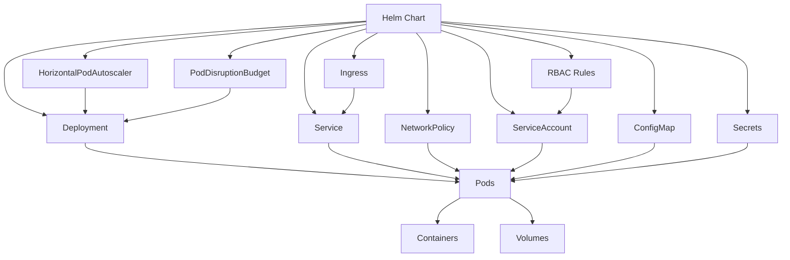

# Deploying with Helm

This guide walks you through deploying the K8s Orchestrator using Helm.

## Resource Relationships in Helm Chart



## Use the Prepared Autopilot Values File

We've created a ready-to-use values file for GKE Autopilot deployments. Navigate to the Helm chart directory and use the pre-configured file:

```bash
cd helm/k8s-orchestrator

# The values-gcp-autopilot.yaml file is already configured for Autopilot deployments
# If you want to examine it:
cat values-gcp-autopilot.yaml

# If you need to make any customizations, use:
# vim values-gcp-autopilot.yaml
# or
# nano values-gcp-autopilot.yaml
```

The pre-configured `values-gcp-autopilot.yaml` includes:

1. **Enhanced resource allocations** for better performance:
   - 1 CPU core (1000m) limit and 0.5 CPU core (500m) request for the orchestrator
   - 1GB memory limit and 512MB memory request
   - Doubled VNC container resources for smoother user experience
   - 4GB persistent volume size for user environments

2. **Optimized resource quotas**:
   - 16 CPU cores total cluster capacity
   - 64GB memory total cluster capacity
   - 4 CPU cores per user environment
   - 8GB memory per user environment

3. **Optimized autoscaling settings**
4. **Properly configured RBAC permissions**
5. **Network policies for security**

The values file is optimized for performance while maintaining cost control.

## Install the Helm Chart

```bash
# Make sure you're in the helm chart directory
cd helm/k8s-orchestrator

# Install the chart using the Autopilot values file
helm install k8s-orchestrator . -f values-gcp-autopilot.yaml
```

## Next Step

Once you have deployed the K8s Orchestrator using Helm, proceed to [Verify Deployment](06-verify-deployment.md).