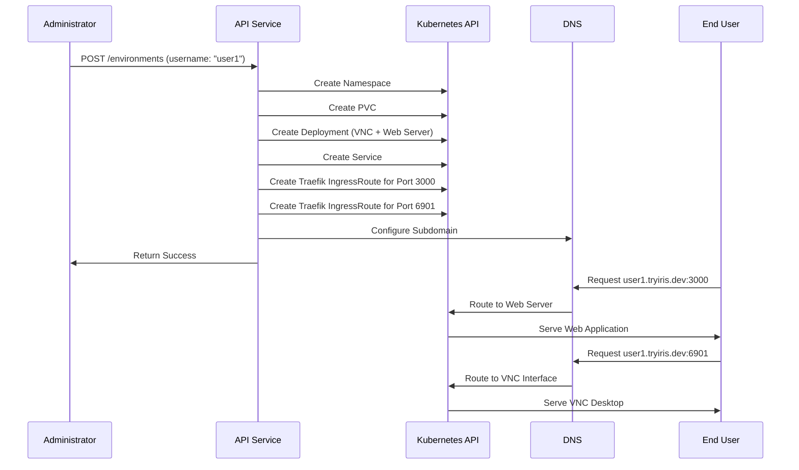

# Verifying the Deployment

This guide walks you through verifying that your K8s Orchestrator deployment is working correctly.

## Check Deployment Status

```bash
# Check the pods
kubectl get pods -l app.kubernetes.io/instance=k8s-orchestrator

# Check the service
kubectl get service -l app.kubernetes.io/instance=k8s-orchestrator

# Check the ingress
kubectl get ingressroute -l app.kubernetes.io/instance=k8s-orchestrator
```

All pods should be in the `Running` state, and the service should have an external IP address. The IngressRoute should be configured correctly.

## Test the API

```bash
# Wait for the Ingress to get an IP and for DNS to propagate
kubectl get ingressroute -l app.kubernetes.io/instance=k8s-orchestrator

# Test the API health endpoint
curl -k https://api.pods.tryiris.dev/api/v1/health
```

You should get a response indicating that the API is healthy. If you're using a self-signed certificate or Let's Encrypt is still provisioning a certificate, you may need to use the `-k` flag to skip certificate validation.

## User Environment Provisioning Flow



## Next Step

Once you have verified that your deployment is working correctly, proceed to [Create and Access User Environments](07-user-environments.md).