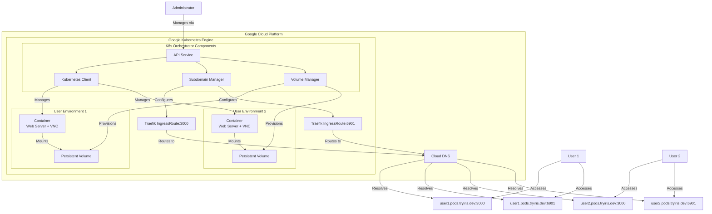
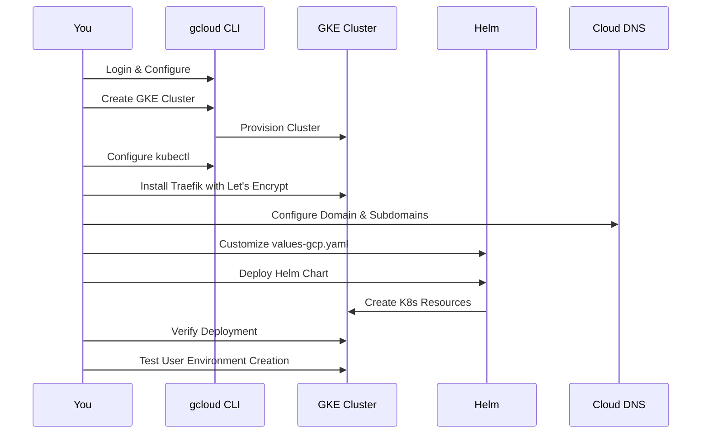

# Deploying K8s Orchestrator to Google Kubernetes Engine (GKE)

This guide walks you through the complete process of deploying the K8s Orchestrator service to Google Kubernetes Engine (GKE). The guide is divided into steps to make it easier to follow.

## Architecture Overview

The following diagram shows the high-level architecture of the K8s Orchestrator deployment on GKE:

## Deployment Process Flow

## Prerequisites

Before you begin, ensure you have the following:

- Google Cloud Platform account with billing enabled
- `gcloud` CLI installed and configured
- `kubectl` installed
- `helm` (v3.2.0+) installed
- Domain name: tryiris.dev with pods.tryiris.dev for user environments

## Deployment Steps

Follow these steps to deploy the K8s Orchestrator to GKE:

1. [Setup Requirements](01-prerequisites.md) - Install and configure required tools
2. [Setup Google Cloud and GKE Cluster](02-setup-gcp-gke.md) - Create and configure your GKE cluster
3. [Setup Core Kubernetes Component](03-core-kubernetes-components.md) - Install Traefik with integrated Let's Encrypt
4. [Configure DNS](04-configure-dns.md) - Set up DNS records for your domain
5. [Deploy with Helm](05-deploy-with-helm.md) - Deploy the K8s Orchestrator using Helm
6. [Verify Deployment](06-verify-deployment.md) - Check that everything is working correctly
7. [Create and Access User Environments](07-user-environments.md) - Create user environments and access them
8. [Scale and Manage Deployment](08-scaling-management.md) - Scale and manage your deployment
9. [Troubleshooting](09-troubleshooting.md) - Common issues and their solutions
10. [Cleanup](10-cleanup.md) - Clean up resources when they're no longer needed